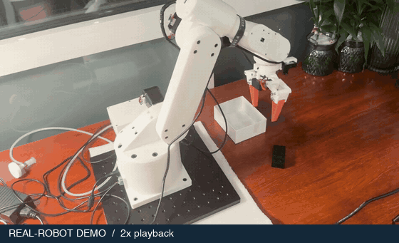
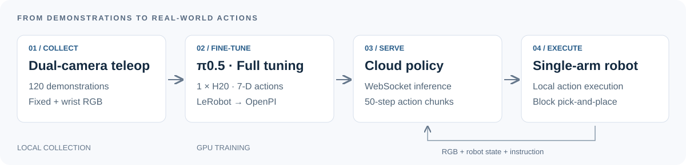
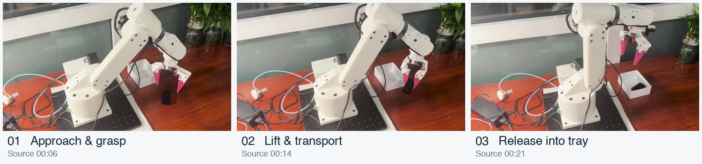

<div align="center">

# π0.5 · Single Arm

**从双相机示范采集到云端策略与真机抓放**

120 条示范 · 单张 H20 全量微调 · 云端推理 · 本地执行

**中文** · [English](README.en.md) · [复现指南](docs/reproduce.md) · [源码与归属](docs/provenance.md)



*真实方块抓放演示 · 2× 播放 · [21 秒原速视频](assets/pick-and-place-realtime.mp4)*

</div>

## 项目概览

在 Episode1 单臂上打通 **数据采集 → π0.5 全量微调 → 云端策略服务 → 本地真机推理**。使用主从臂遥操作与固定/手眼双相机采集 120 条示范，在单张 H20 上微调 π0.5，再由本地客户端获取云端动作序列，驱动机械臂完成方块抓取与放置。



| 采集 | 训练 | 部署 |
| :--- | :--- | :--- |
| 120 条示范，双路 RGB | π0.5 全量微调，1 × H20 | 云端 WebSocket 策略服务 |
| 单臂 6 关节 + 夹爪 | 7 维动作，50 步动作块 | 本地异步接收与动作执行 |

## 真机演示



选自同一连续片段，展示接近、提起与放置。演示为定性记录，不代表统计成功率。[素材来源与时间点](docs/media.md)

## 我做了什么

- **采集链路：**接入遥操作主臂、Episode1 从臂与双相机，统一状态/动作顺序并完成示范数据录制。
- **训练适配：**转换 LeRobot 数据，衔接图像预处理与归一化；完成 π0.5 全量微调，并处理 checkpoint 保存内存和训练恢复问题。
- **真机部署：**将云端策略服务与本地客户端连接，处理动作块执行、状态校验及通信异常恢复。

## 运行入口

```bash
git clone https://github.com/innovationasuna/pi05-single-arm.git
cd pi05-single-arm
git submodule update --init
cp configs/robot.example.json configs/robot.json
```

按 [复现指南](docs/reproduce.md) 安装两端环境并填写设备与数据路径后：

```bash
python scripts/pipeline.py record   # 本地：双相机示范采集
python scripts/pipeline.py convert  # 云端：转换数据
python scripts/pipeline.py norm     # 云端：计算归一化统计
python scripts/pipeline.py train    # 云端：π0.5 全量微调
python scripts/pipeline.py serve    # 云端：启动策略服务
python scripts/pipeline.py infer    # 本地：通过 SSH 隧道执行策略
```

## 代码组织与致谢

`modules/lerobot` 负责采集与真机执行，`modules/openpi` 负责训练与服务；两个子模块固定到明确版本，保留原始历史与许可证。顶层只维护配置、运行入口和文档。

基于 [Physical Intelligence / OpenPI](https://github.com/Physical-Intelligence/openpi) 与 [Hugging Face / LeRobot](https://github.com/huggingface/lerobot)，保留 [openpi_single](https://github.com/innovationasuna/openpi_single) 和 [lerobot_single](https://github.com/innovationasuna/lerobot_single) 两个原仓库。代码采用 Apache-2.0；模型条款与演示媒体说明见 [来源与许可](docs/provenance.md)。
